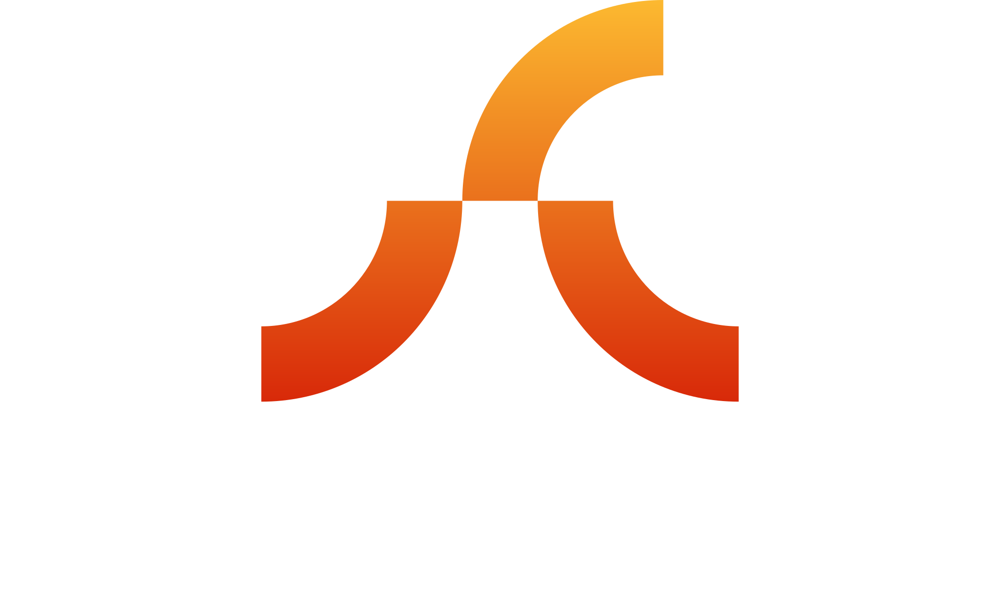

Building Web3 / Blockchain tools with <strong><u>earth-shaking</u></strong> work ethic and <strong><u>fiery passion</u></strong> from the Philippines.

# Projects

	<table>
		<thead>
			<th>Name</th>
			<th>Status</th>
			<th>Description</th>
			<th>Maintainer</th>
		</thead>
		<tr>
			<td><a href="https://github.com/Vulcanic-Labs/crater">crater</a></td>
			<td>WIP</td>
			<td align="left">Tool to manage the entire Vulcanic Labs tooling</td>
			<td><a href="https://github.com/kquirapas">kquirapas</a></td>
		</tr>
		<tr>
			<td><a href="https://github.com/Vulcanic-Labs/hammer">hammer</a></td>
			<td>WIP</td>
			<td align="left">A blazingly fast TUI written in Rust for generating your NFT assets.</td>
			<td><a href="https://github.com/kquirapas">kquirapas</a></td>
		</tr>
	</table>

# Contact Us
Want to outsource Web3 / Blockchain talent in the Philippines? Have something you want built? Send us an email: vulcaniclabs@gmail.com
